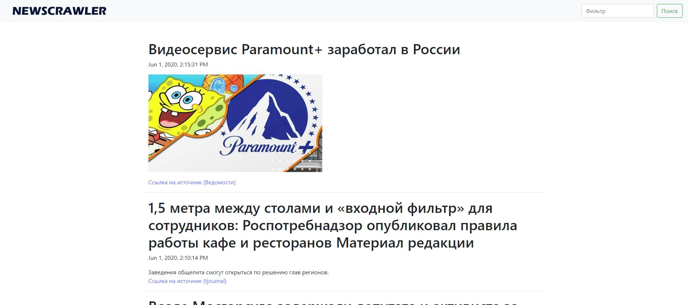

# NewsCrawler

Spring Boot приложение для парсинга новостей с сайтов или rss фида.
На текущий момент работает с текстом, картинками и видео.
По умолчанию добавлено 2 источника новостей: tjournal(HTML) и Ведомости(RSS)



# Документация по методам API:

http://localhost:8080/swagger-ui.html#/

# Примеры использования
Для того чтобы добавить новый источник и задать правило парсинга необходимо выполнить следующий запрос, указав элементы, содержащие необходимую информацию в структуре html/rss.:
```sh
curl -X POST "http://localhost:8080/source/create" -H "accept: */*" -H "Content-Type: application/json" -d "{\"sourceName\":\"tjournal\",\"uri\":\"https://tjournal.ru/\",\"uriTag\":\".t-link\",\"contentType\":\"html\",\"newsContainerTag\":\".feed__item\",\"titleTag\":\".content-header__title\",\"descriptionTag\":\"div > div.content.content--short > div\",\"previewTag\":\"figure\",\"imagePreviewTag\":\".andropov_image\",\"imagePreviewAttribute\":\"data-image-src\",\"videoPreviewTag\":\".andropov_video\",\"videoPreviewAttribute\":\"data-video-mp4\",\"pubDateTag\":\"time\",\"pubDateAttribute\":\"data-date\",\"pubDateFormat\":\"timestamp\"}"
```

Для получения всех существующих в БД источников необходимо выполнить следующий запрос:
```sh
curl -X GET "http://localhost:8080/source/all" -H "accept: */*"
```

Для получения всех существующих в БД новостей необходимо выполнить следующий запрос:
```sh
curl -X GET "http://localhost:8080/news/all" -H "accept: */*"
```

Для получения конкретной новости по идентификатору необходимо выполнить следующий запрос:
```sh
curl -X GET "http://localhost:8080/news/1" -H "accept: */*"
```
